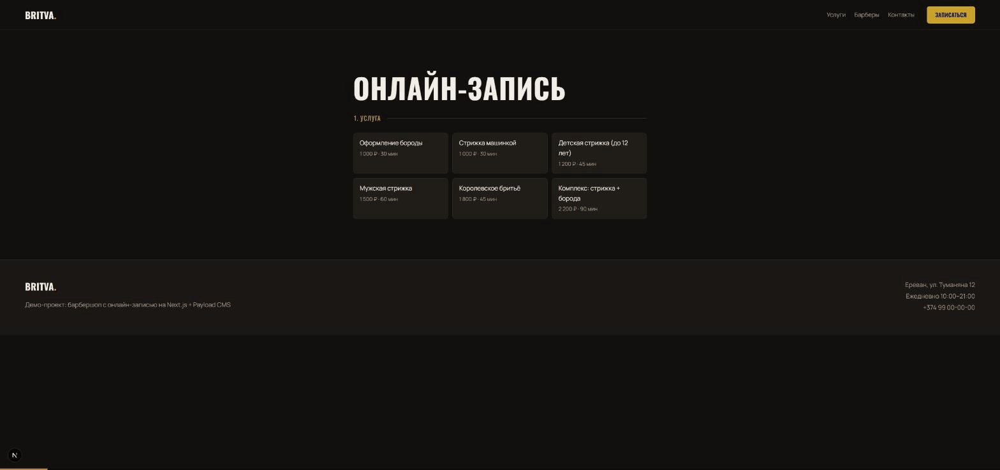

# BRITVA — барбершоп с онлайн-записью

[](https://github.com/Davidsedaliana/barbershop-booking/actions/workflows/ci.yml)
[](LICENSE)

**Полная система записи для барбершопа: публичный сайт, мастер записи в пять
шагов с живым расчётом свободных слотов и админка для владельца.**
Next.js 15 + Payload CMS 3 + SQLite — запускается локально двумя командами,
без внешних сервисов.

[English version →](README.md)



## Возможности

- **Мастер записи в 5 шагов**: услуга → барбер → день → время → контакты.
  Показываются только рабочие дни выбранного мастера; шаг сетки слотов равен
  длительности услуги (стрижка 60 мин → слоты по часу, детская 45 мин → по 45)
- **Живая доступность**: кастомный endpoint `/api/appointments/slots` вычитает
  занятые интервалы (с учётом длительности *их* услуг) и прошедшие часы сегодня
- **Защита от двойной брони**: хук коллекции отбивает занятый слот понятной
  ошибкой — гонка двух клиентов решается безопасно
- **Админка** (Payload CMS): владелец управляет услугами, барберами со сменами
  по дням и записями со статусами — ни строчки кода админки не написано вручную
- **Чистая логика слотов** в `src/lib/slots.ts` — 10 юнит-тестов (vitest)

## Быстрый старт

```
npm ci
cp .env.example .env    # поставь свой PAYLOAD_SECRET
npm run dev             # http://localhost:3000
npm run seed            # демо-данные: услуги, барберы, админ
```

Админка: http://localhost:3000/admin — демо-вход `admin@britva.demo` /
`britva-demo` (создаётся сидом; для чего-то публичного — поменяй).

## Telegram-бот

Тот же флоу записи доступен и как **Telegram-бот** (`bot/`, aiogram 3) — он ходит
в тот же Payload API, что и сайт: та же логика слотов, та же защита от двойной
брони, записи падают в ту же админку. Если слот заняли посреди диалога — бот
предложит свежие времена, а не упадёт.

```
cd bot
pip install -r requirements.txt
cp .env.example .env        # BOT_TOKEN от @BotFather
python -m britva_bot.main   # long polling; сайт должен быть запущен
```

## Как устроено

```
Next.js (App Router)                     bot/ (aiogram 3)
├── (frontend)  лендинг + мастер записи    └── тот же API, FSM-диалог
├── (payload)   админка и REST API ◄──────────────┘
└── collections
    ├── Services      цена, длительность (= шаг сетки слотов)
    ├── Barbers       смены по дням недели
    └── Appointments  публичный create + хук против двойной брони
                      └── GET /slots  расчёт свободного времени
```

Хранилище — один SQLite-файл: идеально для демо и малого бизнеса; переход на
Postgres — замена одной строки адаптера в `payload.config.ts`.

## Тесты

```
npm run test:int   # vitest: математика слотов + интеграция API
npm run lint
```

## Лицензия

[MIT](LICENSE)
